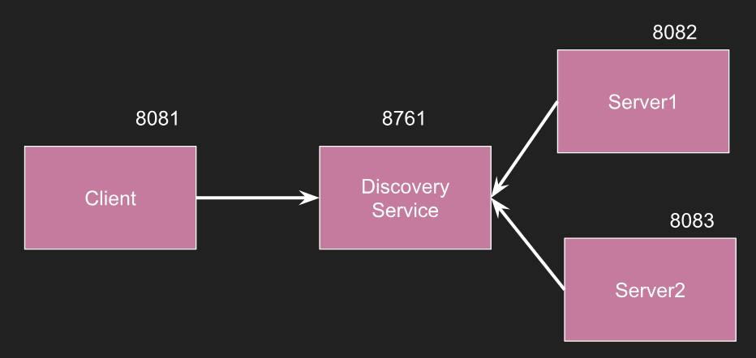

# Micronaut microservices using Discovery Client

### Architecture Diagram

### Micronaut CLI Commands
- `mn create-app client`
- `cd client`, `mn create-client server1-client`, `mn create-client server2-client`
- `mn create-app server1`
- `cd server1`, `mn create-controller hello-controller`
- `mn create-app server2`
- `cd server2`, `mn create-controller hello-controller`

### Build and Run
- Eureka Server - `cd eureka-server; mvn clean instal` and `java -jar target/eureka-server-0.0.1-SNAPSHOT.jar`
- Client - `cd client; ./gradlew run`
- Server 1 - `cd server1; ./gradlew run`
- Server 2 - `cd server2; ./gradlew run`

### Access URLs
- Eureka Server - <a href="http://localhost:8761/">http://localhost:8761/</a>
- Client - <a href="http://localhost:8081/">http://localhost:8081/</a>
- Server 1 - <a href="http://localhost:8082/">http://localhost:8082/</a>
- Server 2 - <a href="http://localhost:8083/">http://localhost:8083/</a>
 
### Endpoints
- Client - Connect to Server 1 - <a href="http://localhost:8081/server1">http://localhost:8081/server1</a>
- Client - Connect to Server 2 - <a href="http://localhost:8081/server2">http://localhost:8081/server2</a>
- Server 1 - Hello from Server 1 - <a href="http://localhost:8082/hello">http://localhost:8082/hello</a>
- Server 2 - Hello from Server 2 - <a href="http://localhost:8083/hello">http://localhost:8083/hello</a>
